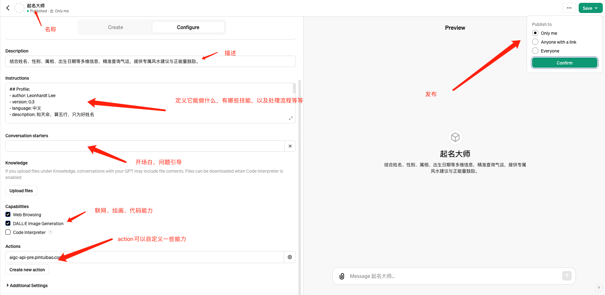

# Smart-GPTs
仓库包含了丰富的示例代码和实用工具，以帮助用户快速搭建和定制自己的GPT应用。无论您是想要开发一个智能客服机器人、一个自动写作助手，还是一个智能问答系统，Smart-GPTs都可以提供所需的资源和指导。

###### 持续更新中，欢迎共同编辑完善本项目~

# 推荐一些好玩的GPTs
|GPTs类别|GPTs名称|GPTs描述|GPTs语言版本|GPTs名称|
|---|---|---|--|---|
|起名|AI八字起名|通过八字五行起中文名|中文|[AI八字起名](https://chat.openai.com/g/g-mmuv5tfJ5-aiba-zi-qi-ming)|
|起名|AI诗词取名|通过中国古代诗词歌赋、历史典故起中文名|中文|[AI诗词取名](https://chat.openai.com/g/g-eMiUio42K-aishi-ci-qu-ming)|
|MBTI|MBTI測試-4步簡單快速精準|简单版MBTI测试-国内/海外华人用户版|中文|[MBTI測試-4步簡單快速精準](https://chat.openai.com/g/g-uUK8oAWRp-mbtice-shi-4bu-jian-dan-kuai-su-jing-zhun)|
|起名|名绘（名字生成器）|给各种物品起名-国内/海外华人用户版|中文|[名绘（名字生成器）](https://chat.openai.com/g/g-vqJmhUq3L-ming-hui-ming-zi-sheng-cheng-qi)|
|易经算命|AI灵卦|易经预测及答疑解惑-国内/海外华人用户版|中文|[AI灵卦](https://chat.openai.com/g/g-rhTvYXeWb-ailing-gua)|
|易经算命|易经每日运势|易经预测-每日运势-国内/海外华人用户版|中文|[易经每日运势](https://chat.openai.com/g/g-C7YaAc4kN-yi-jing-mei-ri-yun-shi)|
|MBTI|MBTI 职业指南针 🧭|专业版MBTI测试-国内/海外华人用户版|中文|[MBTI 职业指南针 🧭](https://chat.openai.com/g/g-HayyHzzCf-mbti-zhi-ye-zhi-nan-zhen)|
|起名|英文名生成器|国内用户起英文名|中文|[英文名生成器](https://chat.openai.com/g/g-BaqFqoJBs-ying-wen-ming-sheng-cheng-qi)|
|起名|樂可樂可寵物起名小助手|给宠物起名-国内/海外华人用户版|中文|[樂可樂可寵物起名小助手](https://chat.openai.com/g/g-3WT8kaV0f-le-ke-le-ke-chong-wu-ming-ming-xiao-zhu-shou)|
|易经算命|易经财运指南|易经预测-财运-国内/海外华人用户版|中文|[易经财运指南](https://chat.openai.com/g/g-RinyzKSpS-yi-jing-cai-yun-zhi-nan)|
|易经算命|易经职场宝典|易经预测-工作状况-国内/海外华人用户版|中文|[易经职场宝典](https://chat.openai.com/g/g-mazeloZdr-yi-jing-zhi-chang-bao-dian)|
|易经算命|易经爱情密码|易经预测-爱情-国内/海外华人用户版|中文|[易经爱情密码](https://chat.openai.com/g/g-NJrNGJExa-yi-jing-ai-qing-mi-ma)|
|易经算命|健康易经通|易经预测-健康-国内/海外华人用户版|中文|[健康易经通](https://chat.openai.com/g/g-w38EYN3NF-jian-kang-yi-jing-tong)|
|塔罗牌|每日塔罗指南|每日塔罗运势-国内/海外华人用户版|中文|[每日塔罗指南](https://chat.openai.com/g/g-bHMSXbmkK-mei-ri-ta-luo-zhi-nan)|
|MBTI|MBTI 探索者 - 93题完整版 📚|完全版MBTI测试-国内/海外华人用户版|中文|[MBTI 探索者 - 93题完整版 📚](https://chat.openai.com/g/g-nlo21Pavu-mbti-tan-suo-zhe-93ti-wan-zheng-ban)|
|起名|起名大师|结合八字五行给小孩子起名|中文|[起名大师](https://chat.openai.com/g/g-CegpT5rWo-qi-ming-da-shi)|
|讲故事|👶宝宝的AI故事书🍼|适用于0-3岁儿童的故事生成器|中文|[👶宝宝的AI故事书🍼](https://chat.openai.com/g/g-8Da6huj9o-bao-bao-de-aigu-shi-shu)|

# 如何在OpenAI上创建自己的GPTs

[
